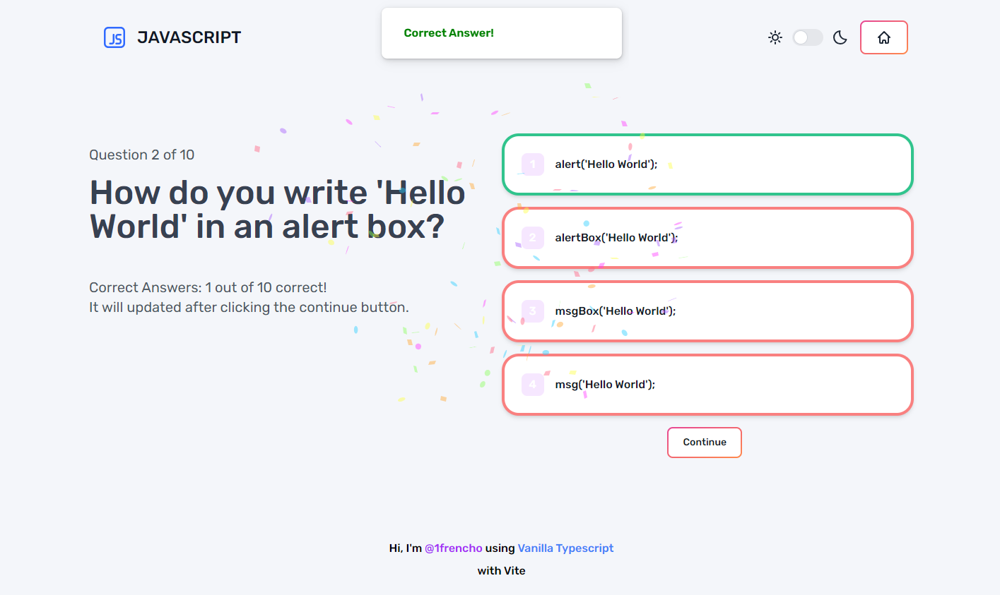

# Quiz App Challenge using Vanilla TS

Task developed by [**@1frencho**](https://github.com/1frencho) for Kodigo Academy. I tried to make it as a single page for every subject on the quiz.



- Questions provided by ChatGPT on /src/data

## Technologies used

- Vanilla JS (Build with Vite)
- TypeScript

## Libraries used:

- Tailwind CSS
- Animate.css
- Flowbite
- SweetAlert2
- Canvas Confetti

## Use development workspace:

```
npm install
```

```
npm run dev
```

Check changes on classes with Tailwind CSS on index.html. if classes are not working, it's because there are not on the index.html file, due to html is rendered on js files, so add classes on index.html.

Just leave tailwind classes on html comments. And use:

```
npm run watch
```
